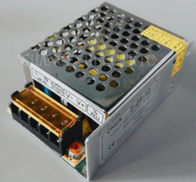

# Parametrized Case for Power Supply

## Description

There are nice cheap Chinese switching power supplies can be found on AliExpress, like this one: 

They are pretty common among hobbyists as power source in their project because they provide quite acceptable output 
power quality for low price.

One of the drawbacks of such powers supplies is their metal body, which has dangerously opened high voltage contacts.

This project provides ready to use parametrized 3D modelled case for this power supplies. It contains ready STL files 
for power supply sized approximately 90x60mm. Also, if you need other dimensions, you can adjust source 3D model in
Autodesk Fusion 360.

## How To Use

- Open [STL-files](stl/) in your favourite slicer.
- Prepare models for printing.
- Slice and print.

## How To Get Custom Sized Case

- Open [source 3D model](src/power-supply-case.f3d) in Fusion 360.
- Open "Parameters" dialog and set variables in "User Parameters" for your needs.
- Export STL models.
- Print.

## Example

You can find built examples [here](https://www.thingiverse.com/thing:3674960).

## Built With

- [Autodesk Fusion 360](https://www.autodesk.com/products/fusion-360/overview).

## Contributing

Please read [CONTRIBUTING.md](CONTRIBUTING.md) for details on our code of conduct, and the process for submitting pull 
requests to us.

## Versioning

I use [SemVer](http://semver.org/) for versioning. For the versions available, see the
[tags on this repository](https://github.com/ashep/power-supply-case/tags).

## See also

- [Project on Thingiverse](https://www.thingiverse.com/thing:3674960).
 

## Authors

* [Oleksandr Shepetko](https://shepetko.com) -- initial work.

## License

This project is licensed under the MIT License - see the [LICENSE.md](LICENSE.md) file for details.
